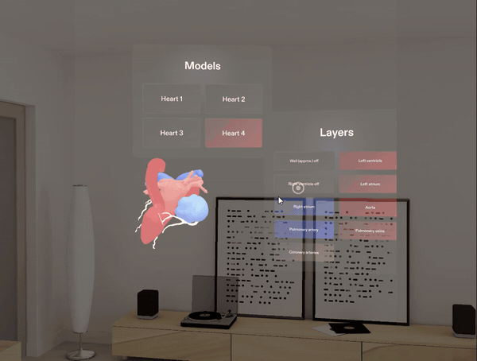
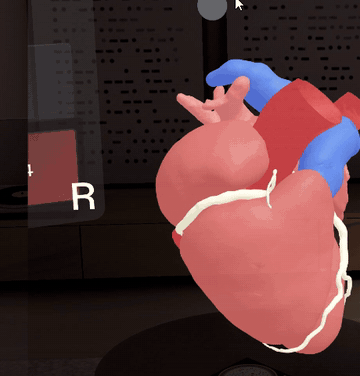
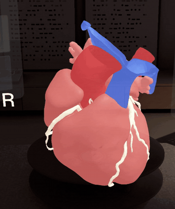
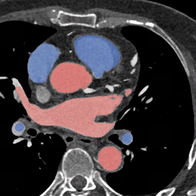

# Open Heart

Open Heart turns a cardiac CT scan into a 3D heart that stands in the room with you. A Python script converts the
scan's segmentation into a model, and the viewer lets you peel it layer by layer, point at a structure to see its
name, and compare it with other hearts.

Four hearts from a public dataset come with the project as examples. The point is the path from scan to model: bring
your own segmentation, run one command, and it becomes one more heart on the Models panel.

<p align="center">
  
  <br><sub>A swipe spins the heart; pointing at it again stops it. All clips were recorded in the editor's preview.</sub>
</p>

## Where the idea came from

In dentistry, 3D imaging already supports specialists' decisions every day. Cone beam CT software is how many of them
look at a tooth before treating it, and the case for it was made with data: in Estrela et al. (2008), periapical and
panoramic radiographs found only 55% and 28% of the apical periodontitis lesions that cone beam CT showed.[^1]

That result is what made me look at cardiac CT, and at AR glasses as a way to see it. Open Heart does not detect or
measure anything; it shows anatomy. If a tool like it ever reaches a clinic, it will need a study like that one first.

[^1]: Estrela C, Bueno MR, Leles CR, Azevedo B, Azevedo JR. Accuracy of cone beam computed tomography and panoramic
    and periapical radiography for detection of apical periodontitis. *Journal of Endodontics*. 2008;34(3):273–279.

## Why I built it

I want to show what AR glasses can do in a professional setting. The scenario is a cardiologist's office: the doctor
studies the heart in 3D instead of scrolling through grey slices, then turns it towards the patient to explain what
they are looking at and what a procedure would involve.

It is open source so that developers in other fields can take the same approach: split a scan or a 3D model into
named parts, then let people hold it, turn it and take it apart.

### From scan to glasses

The path to a real product needs little new technology:

1. The doctor uploads the patient's CT scan to a server.
2. An AI segmentation model labels the heart's structures. Open-source models that do this already exist.
3. `tools/seg_to_glb.py`, from this project, turns the labels into a 3D model.
4. The glasses download the model over the internet when the doctor opens Open Heart.

Today only step 3 is automated. The example labels come from the dataset's authors (step 2), the script runs by hand
on a computer, and the models ship inside the project instead of being downloaded (step 4). What is missing is mostly
not code: protecting patient data (LGPD, HIPAA, GDPR) and getting regulatory approval.

> **Education and discussion only.** This is not a medical device and must not be used for diagnosis or treatment
> decisions.

## What is in it

| Peel the layers | Tap for a name | Compare hearts |
| :---: | :---: | :---: |
|  |  |  |

- **Four example hearts from four people**, shown at their true size relative to each other: the largest is 16 cm tall.
  Each one has its own muscle wall and coronary arteries.
- **Nine structures:** the four chambers, the aorta, the pulmonary artery, the pulmonary veins, the coronary arteries
  and the muscle wall. Each one can be solid, see-through or hidden.
- **Names on demand:** tap a structure and every other one turns grey while its name appears above the heart.
- **Textbook conventions:** the anterior view that anatomy atlases use, R and L markers for the patient's right and
  left, red where blood carries oxygen, blue where it does not, and ivory coronary arteries.

## Controls

On the glasses you pinch with your fingers. In the editor's preview, a mouse click does the same.

| Do this | To |
| --- | --- |
| Tap (quick pinch) a structure | Highlight it; tap it again to clear |
| Pinch and hold the heart, then move your hand | Move it. Held up close, it also turns with your hand |
| Point at the heart and swipe left, right, up or down | Spin it that way, as fast as the swipe. It slows down by itself |
| Point at a spinning heart again | Stop it where it is, to set an exact angle |
| Pinch the heart with both hands and pull apart or together | Make it bigger (up to 5x) or smaller |
| Press a button on the **Models** panel | Switch hearts |
| Press a button on the **Layers** panel | Step that structure: solid, 30%, hidden. Each button has its structure's colour |
| Pinch a panel's background and move | Move the panel. Panels always turn to face you |

## Built without the glasses

I'm Augusto, a developer in Brazil. The glasses are not sold here, and I have never worn a pair. Everything in this
repository was built and tested in the editor's preview: the interactive room with a mouse, and the webcam preview
with my phone strapped to my forehead as the camera.

That shaped the code. Grabbing, two-hand scaling, the buttons and the panels that turn to face you all come from the
platform's own interaction and UI kits, which their makers tested on the device. I also ran them through simulated
hands in the editor: the layer and model buttons, the highlight, two-hand scaling, and a full-arm reach test on both
panels all pass. The swipe to spin, and pointing again to stop it, are my own code and cannot be simulated there,
because a simulated hand has no pointing ray. Nobody has tried them on real glasses yet. If you have a pair, a report
would help a lot: open an issue with what worked and what did not.

## Run it

1. Install Lens Studio 5.24 or newer.
2. Open `OpenHeart.esproj`.
3. The Preview panel runs it. If it shows a phone, pick the AR glasses in the Preview panel's device menu. The first
   seconds can be slow while the four models load. The models are in `Assets/Models`, so nothing else needs to be
   installed.

**Hands without glasses:** switch the Preview panel to webcam input and wear the camera on your forehead. A phone
running a webcam app works. The editor mirrors webcam input, so flip the image horizontally in the webcam app to undo
it. Webcam hand tracking is much rougher than the glasses', so swipes and pinches work less reliably there.

## Add your own heart

`tools/seg_to_glb.py` turns a whole-heart segmentation (NIfTI) into a GLB with one mesh per structure. It was tested
with Python 3.12 and takes about three minutes per heart.

```bash
pip install -r tools/requirements.txt
python tools/seg_to_glb.py 113.img.nii.gz Assets/Models/heart_113.glb
```

<p align="center">
  
  <br><sub>What the script reads: case 91's CT slices with their labels, in the viewer's colours.</sub>
</p>

The input is one of the dataset's `segmentations/<case>.img.nii.gz` files (see Data and credits), with these labels:
1 myocardium, 2 left atrium, 3 left ventricle, 4 right atrium, 5 right ventricle, 6 aorta, 7 pulmonary artery, 8 left
atrial appendage, 9 coronary arteries, 10 pulmonary veins.

The script:
- meshes each label with marching cubes, then Taubin smoothing and quadric decimation to at most 15,000 triangles
  (30,000 for the wall)
- builds the muscle wall from the labelled myocardium, plus the other chambers grown by a typical wall thickness
- turns the heart to the textbook anterior view and centres it
- writes a GLB with normals and textbook colours, kept bright because the glasses' see-through display turns dark
  colours transparent

Then, in Lens Studio, drag the GLB under `HeartViewer/HeartRoot`. The Models panel gets a button for it, numbered in
the order of `HeartRoot`'s children.

**Other anatomy, or another field:** edit `PARTS`, `MUSCLE` and `WALL_MM` in `tools/seg_to_glb.py`, then `LAYERS` in
`Assets/Scripts/HeartLayersUI.ts`. The layer names in `LAYERS` must match the mesh names the script writes.

## Project layout

| Path | What it does |
| --- | --- |
| `Assets/Scripts/HeartViewer.ts` | Loads the models, applies the layers, and handles grabbing, spinning and highlighting |
| `Assets/Scripts/HeartLayersUI.ts` | The Models and Layers panels, built from the platform's UI components |
| `Assets/Models/` | The four hearts, as GLB files |
| `tools/seg_to_glb.py` | Segmentation to GLB |
| `docs/` | The clips shown in this README |

## Data and credits

The hearts come from the whole-heart labels of Hansen B, Pedersen J, Kofoed KF, Camara O, Paulsen RR, Sørensen K,
*A Public Cardiac CT Dataset Featuring the Left Atrial Appendage* (STACOM 2025), licensed CC BY 4.0:
[github.com/Bjonze/Public-Cardiac-CT-Dataset](https://github.com/Bjonze/Public-Cardiac-CT-Dataset). Those labels are
drawn on the public
[ImageCAS](https://github.com/XiaoweiXu/ImageCAS-A-Large-Scale-Dataset-and-Benchmark-for-Coronary-Artery-Segmentation-based-on-CT)
coronary CT angiography scans.

| Model | Case |
| --- | --- |
| Heart 1 | 113 |
| Heart 2 | 133 |
| Heart 3 | 13 |
| Heart 4 | 91 |

The dataset has no diagnoses, so none are shown.

The models were meshed, smoothed and reposed from the dataset. Only the left ventricle's muscle is labelled there, so
the rest of the muscle wall is an approximation, and the Layers panel says so.

## License

Code: MIT (see `LICENSE`). Heart models: CC BY 4.0, as above. The packages in `Packages/` belong to their
authors and keep their own licenses.
